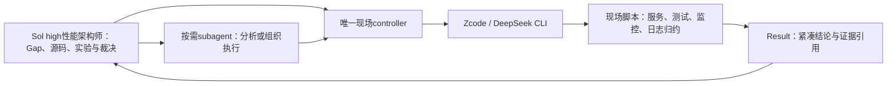

# Zcode / subagent任务交接协议 v1

从checkpoint158之后执行分工与研究路线按[AGENTS](../AGENTS.md)生效；协议/桥接schema保持不变，不实现自动模型路由，不改历史Job/Run/raw/裁决。PID/hash/epoch/controller/ownership只保留真实性、安全、可复现及裁决需要的信息，不扩展为主要研究工作。

v2后续性能Job引用Sol的规则身份/Performance Research Reset、当前唯一性能假说及Run前Hypothesis / Distinguishing evidence / Decision table；没有研究门槛证据返回needs_decision，不自行创建路线、批量正式E2E或参数扫描。一个区分diagnostic仅服务该主假说；大型正式E2E等待诊断支持/correctness通过/产品裁决价值。这里是执行合同，不改桥接schema或假称工具已自动校验这些研究要求；功能/工程Job不计PERF_KEEP。

用户确认Zcode是接DeepSeek的CLI，可使用`zcode --prompt`。后端具体model id、CLI路径及现场controller在执行环境核验；本次未实际调用DeepSeek或启动服务。协议固定可追溯交接，不限制研究方向。

## 1. 谁做什么



- GPT-6.1 Sol high主Agent是性能架构师，负责目标、最大Gap、因果、架构、关键源码、复杂Runtime/Scheduler重构、实验设计、matched A/B和KEEP/Current裁决；可直接派执行任务给Zcode，不强制经过subagent。Astra按[模型策略](research/AGENT_MODEL_STRATEGY.md)做独立Challenger，不常驻、不做日常Run或每轮审批。
- subagent用相同Job/Result格式做独立分析、定向复核或组织Zcode执行。涉及共享服务/源码/设备的操作先交已有controller排程，不能另起竞争controller。离线只读归约可独立运行。
- Zcode / DeepSeek只承担执行层：服务器、服务启动/停止/恢复、benchmark/monitor/profile采集、大日志/trace归约、artifact身份及机械修改，不决定长期性能主线。Result紧凑返回，大raw留现场；涉及Gap、根因、架构、关键代码或KEEP，Sol必须亲读必要源码/关键diff/profile/决定性raw，不能只依赖Result Summary。next_action或decision_request建议不是必须继承的路线。
- Job是工作单，不是性能Run。`parent.run_id`关联真实Run；尚未执行性能实验时可为null。重试用新job_id并保留旧结果，同一次实际Run的归约/监控可有多个Job。

## 2. 文件与接口

复用权威Run目录：`<run_dir>/jobs/<job_id>/{job.json,result.json,cli.stdout.log,cli.stderr.log,bridge.json}`。没有Run时放当前优化点的辅助任务目录，不能造虚假Run。示例模板在[templates/zcode](../templates/zcode/)。

Job字段：

本地mock演练Job增加`simulation:true`，Result也必须显式标记；bridge将后端记为simulated。该标记用于区分证据身份，不是禁止网络/服务操作的sandbox；[专用模拟器](../scripts/simulate_zcode_handoff.py)仅运行固定合成输入和mock CLI。

| 字段 | 含义 |
|---|---|
| schema_version / job_id / parent | 协议版本、唯一工作单、优化点/Run引用 |
| owner / controller | 负责的主/subagent、已有现场controller身份 |
| kind / goal | 如start_service、benchmark、monitor、reduce_logs、inspect、implement；类型可扩展 |
| inputs | 路径/源码ref/代码身份等输入引用，避免把大原始数据嵌入prompt |
| scope | 可修改路径、可操作的实例/设备、运行环境；这是任务合同，不是OS隔离实现 |
| acceptance | 需要满足的可检查条件 |
| execution | mode=task或command、work_type=analysis/command/persistent、cwd、prompt/完整command、CLI timeout秒 |
| result | 绝对path和max_bytes；大小上限可按问题调整，限制交接输出，不限制探索 |

task模式将Job与返回格式交给DeepSeek，让其生成指定result.json。command模式保持完整shell命令，桥接器在prompt前加入一次Bash执行且禁止改写脚本Result的说明，避免绝对路径被CLI误判为斜杠命令；适用于已经会写result.json的现场脚本。其他任务用task模式组织。work_type独立描述工作性质：analysis为归约/离线调查/文件修改，command为需验收内层退出的现场执行，persistent为驻留服务/监控；task模式启动服务/测试不能伪装成analysis。只使用已知`--prompt`参数，不臆造CLI的JSON/模型选择选项。

```text
python3 glm5-3/scripts/zcode_bridge.py run /absolute/path/job.json
python3 glm5-3/scripts/zcode_bridge.py validate /absolute/path/job.json /absolute/path/result.json
```

bridge必须在Zcode实际可用且能访问输入/现场controller的环境运行。CLI stdout/stderr落文件，终端只输出紧凑交接。`bridge.json`记录真实CLI退出/超时及日志位置/大小/hash；result由执行者写入，格式缺项、ID不符、过大或外层失败会返回INVALID，不能只凭退出0宣称成功。job.claim仅防同一工作目录重复/并发覆盖，不是现场资源锁。超时终止本次CLI进程组；需驻留的controller应使用独立会话并记录身份，CLI超时不证明服务已清理。桥接器不自动把任意命令变成持久服务或监控。

validate默认联检bridge退出证据；subagent的原生返回没有CLI时用`validate --format-only`，结果明确为FORMAT_VALID，不表示已验证执行。校验器不重新运行任务或探测远端进程。

## 3. Zcode或subagent返回什么

Result最小字段：

```json
{
  "schema_version": 1,
  "job_id": "ZCODE-JOB-0001",
  "status": "completed",
  "summary": "事实与条件结论的短摘要",
  "execution": {"inner_exit_code": null, "acceptance": "passed", "processes": []},
  "findings": [],
  "evidence": [],
  "unknowns": [],
  "decision_request": null,
  "next_check_at": null
}
```

- status取queued/running/completed/failed/cancelled/timed_out/needs_decision。completed需acceptance=passed；work_type非analysis还需真实inner_exit_code=0。分析任务没有内层命令时可为null，不能拿它证明被分析Run执行成功。
- findings每项含`kind:fact/inference`、`text`、`scope`和`evidence_ids`；scope注明测量窗口/过滤/实例rank覆盖，evidence_ids引用本Result已有证据ID。可扩展value/unit等字段。缺失和未覆盖写unknown，不能填成0。
- evidence每项保存id、path/uri、sha256、bytes和locator；locator可为行/事件/请求/样本ID或归约文件。已知值如实记录，不可核验值用null。大原始日志/trace留现场，仅提取相关样本。
- processes每项给真实host/role/pid或session_id、readiness(ready/unready/unknown)及evidence_ids；running必须有非空进程/会话与对应证据引用。尚未就绪保持unverified，不存在或未知不能编造。decision_request说明需要主Agent判断的具体问题与相关证据，避免把整个日志作为问题返回。
- 工具验证的是格式和实际CLI调用状态，不证明模型功能、测量因果或全部证据真实性。主Agent直接研究与定向核验，KEEP仍遵循[RECORDING](../RECORDING.md)：无matched A/B不算代码性能成果，无真实完整E2E不提升Current；Job/VALID/功能测试数不计代码KEEP进展。

## 4. 长期服务与监控

现场controller持久保存进程身份、heartbeat、原始状态和日志。一次CLI返回running只表示已交接，需有可核验的持久进程/会话与就绪证据；不能视为实验完成。监控循环运行在脚本中，不靠不断启动模型调用维持。

只在完成、失败、健康/性能阈值越界或需要决策时返回Result变化；正常采样落盘。next_check_at是建议检查时间，不是已创建的Codex定时任务。保持同一Job身份，result用临时文件+原子rename更新；已有Run的原始证据保持不变。

取消/清理只处理本次资源，记录真实退出和恢复；持续任务交接说明哪些仍在运行。监控频率/采集强度避免污染正式性能，prof与正式Run分开。Git只提交工作单、短归约、裁决和证据索引，不提交大日志、权重、凭据或本机私有配置。

## 5. 当前验证

`python3 -m unittest discover -s glm5-3/tests -p 'test_zcode_bridge.py' -v`的3个测试通过，含9类失败子用例：原始CLI输出留文件、缺失/错ID/过大Result、内层失败或未知退出、外层失败、超时、running缺进程身份均按协议处理；重复工作目录拒绝覆盖，format-only不冒充CLI执行核验。仅使用模拟CLI，未调用DeepSeek、现役服务器或性能实验。

另已执行[新对话模拟交接](START_NEW_CHAT.md)，明确返回现场缺项与Current=unknown。实际环境接入后需核验CLI版本/后端与真实只读Job，不能用mock演练代替现场联调。

## 6. 按需模拟，零模型/服务器调用

已有有效演练无需重跑；仅在新执行环境或协议改变影响交接时按需验证，不以模拟阻塞源码研究。在仓库根执行，输出目录必须是新目录，建议放仓库外：

```text
python3 glm5-3/scripts/simulate_zcode_handoff.py --output-dir /absolute/new/simulation-directory
```

它创建合成输入和mock CLI，调用正式桥接器，实际走Job → CLI输出落盘 → Result → 校验 → 主Agent摘要。产物全部标simulation=true；model_calls=0、run_id=null，不访问网络、DeepSeek、NPU或现役服务。

预期结果是handoff=VALID、task_status=needs_decision、Current=unknown。模拟证明协议传递、原始输出隔离和缺项识别；不证明CLI后端可用、服务就绪或推理性能。模拟原始日志保留在指定目录，不提交Git。
