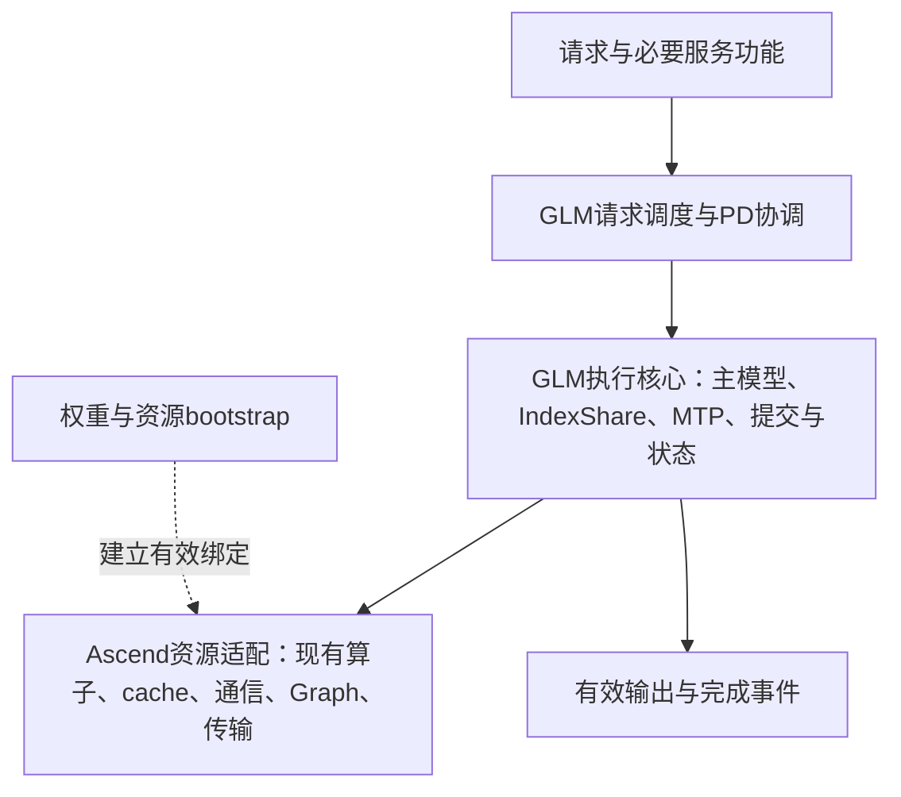

> 研究快照：整理于2026-10-01，随后作为按需资料发布；文中未提交/未运行陈述描述研究采集阶段，不代表后续Git发布状态。实际运行状态以局部HANDOFF和Git为准。

# GLM专用推理框架：动态PD与极限调度方案

日期：2026年10月1日。根据用户最新要求，本方案的最终产物是GLM专用推理框架，支持可变输入输出和不同PD/并行部署，在当前阶段保持现有算子计算实现，追求合法执行下的最大性能。当前仍是方案设计，首先确定极限判据、证据与逼近方法，再依据最高价值Gap选择代码路线；V2作为优先架构候选，允许大幅重构控制代码，同时降低模型调用、长启动、长测试和返工成本。判据与方法的完整说明见MULTINODE_PD_SCHEDULING_LIMIT_PLAN.md。

当前参考现场：用户确认两台同规格、卡配置相同的Ascend 910C服务器；结合前文，方案按每台8卡16芯理解，实际实例/rank到设备映射仍由现场恢复。vLLM-Ascend版本标识0.27、DP1/TP16/EP16、PD已运行、GLM采用MTP路线。未来可能使用1P3D等部署。使用已有GLM-5.2权重，项目目录保留glm5-3，不做5.2/5.3精度比较、量化质量评测或5.3验收。本轮只进行了官方资料/源码研究并产出方案，没有连接运行机器、实现框架、运行benchmark或提交GitHub。

本阶段以当前两台服务器和实际具备的实验条件收敛。未来1P3D等是扩展方向；需要额外硬件的配置标为当前不可实施，给出当前条件下的结论，不把扩容实验作为本阶段完成门槛。同资源内可行的部署调整与授权代码重构仍可探索，未来新资源另开研究域。

## 1 目标、功能与探索权

目标是为GLM的MLA/DSA、Full/Shared IndexShare、MoE、MTP和状态生命周期定制执行与调度框架。专用性落在模型语义、内部数据关系和执行组织上；输入/输出长度、请求集合、batch、并行布局和P/D配置可以变化。DP1/TP16/EP16是首个参考点，不是最终唯一配置。多种拓扑可以通过配置和必要的bootstrap支持，不预先承诺在途请求能无成本热迁移。

用户明确功能都要，不接受手工枚举形成限制。默认保留GLM对应的完整推理服务能力与语义：从vLLM-Ascend相关接口、参数、返回/错误协议、调度和模型分支、现有测试及真实行为恢复功能合同，持续发现与补充。流式、动态进出、取消/超时、prefix cache、MTP、tool/JSON/grammar、logprobs、抢占/恢复等是必须保留的基本能力示例，不是功能白名单，也不需要用户逐项列全。尚未验证的能力写待验证，不能默默关闭、降级或因为早期文档没有列出而排除。

允许专用热路径与必要兼容路径共存，使用一致的请求、状态、提交与输出契约。记录兼容路径的触发原因、占比、切换及暴露成本；关键兼容路径同样进入调度优化，不能成为永久免责入口。正式性能覆盖实际请求与必要功能，不过滤复杂请求换跑分。功能支持与性能结果一起裁决，不能靠遗漏请求、少算token、改输出协议或截断长度获得表面提速。功能合同可作为MISSION附表，不必先造完整空文档。

只固定目标、当前算子边界、必要功能和证据要求。Agent可重建问题、推翻历史结论，选择未列出的方向，跳过/合并/拆分/并行工作，实施结构原型或整体替换控制层，调整同资源预算下的部署、batch、合法MTP配置、Graph、buffer、queue、通信与Runtime边界。候选、接口名、模块拆分、实验习惯和模型角色都是可修改建议。无需先建立完美DAG或完整数值Bound才动手，也无需每Run先获第二模型同意。

## 2 优先实现候选：借资源基础，GLM拥有执行控制

可将一套实际可运行的V2组合的加载与资源能力，通过少量明确适配接口提供给GLM执行层；把大改集中在GLM自己的请求、状态、batch、step与PD调度代码。这样有望较快进入真实权重与服务闭环，同时保留替换不必要框架边界的空间。这是优先评估的开发候选，不是已经决定的最优路线；先用当前证据、最小诊断或原型判断能缩小哪个Gap，不先因代码结构偏好实施大改，也不未经实验宣称最终吞吐最快。

| 层次 | 初始复用或新建范围 | 最终边界 |
|---|---|---|
| Bootstrap/Ascend资源适配 | 权重与量化加载、现有模型/算子、通信组、cache分配、sampler/MTP、Graph与connector必要资源 | 一次或按配置重建；尽量退出每step的控制路径 |
| GLM执行核心 | 主模型、Full/Shared index、MTP、验证/提交、状态和buffer、合法Graph/queue编排 | 可以逐段接管，也可整体重写热路径；不必保留通用ModelRunner/Scheduler控制 |
| 请求与PD协调 | 动态准入、batch规划、结束/补位、KV ready、传输/接收绑定、资源预算与背压 | 模型内部契约通用，部署/路由策略可变 |
| 服务适配 | tokenizer、协议、采样/功能参数、输出与指标 | 初期保留可运行入口，按性能与功能需要演进 |

图表达控制边界，不规定物理节点数量或固定执行顺序。P/D角色和并行映射由部署描述实例化；内部producer-consumer关系由模型与实际算子决定。

部署描述应分别表达P池/D池实例数量、每实例的并行与容量、实例到服务器/rank的映射和传输关系。当前两台服务器不是永久1P1D约束，后续1P3D、多个P配多个D、同机资源切片或扩容部署均可研究；实例数量不自动等于物理机数量。新增实例是否放得下由实际权重/cache和并行布局决定，不宣称当前两台可运行任意配比。共享GLM模型语义与执行核心，路由、准入、KV位置及交接、各池背压与负载策略随部署选择。D选择时机、prefix/KV locality与等待/迁移成本都是可探索问题，不能只按请求数或硬编码一对一绑定。

框架收益首先比较同部署、同资源下的Stock与候选。单实例、两台独立混部实例和两台PD之间的对照用于研究部署效果；后续1P3D若增加总资源，要单列扩容/资源效率与同拓扑代码收益。无需每次扫描全部P/D组合，按当前瓶颈与信息价值选取证据。

vLLM-Ascend代码大、依赖多，大范围修改通用多模型路径确实会增加理解、合并和回归成本。无需先通读或fork重写整仓库：定位当前GLM使用的最小闭环，将private API、forward context、global patch与资源绑定隔离在适配层；GLM核心由自己的代码演进。适配层过厚或原组件限制关键路径时，继续接管，不把复用组件当永久架构限制。

## 3 V2优先，但以实际安装和性能证据选择

公开V2将req_states、input_buffers、speculator、Graph manager与execute_model/sample_tokens分开，便于识别资源/控制边界；它仍继承upstream GPUModelRunner并依赖metadata、cache和全局状态，不是天然独立小库。V1也已有Graph和异步机制，不能只凭代码结构宣布V2性能胜出。

本次源码固定Ascend commit a8fcedb03d93e60efceddbfc912406f7fa491d57与vLLM commit 4c2d277643e217344056e1d2c42115d5f005912f，各自main仅用于代码定位，未验证它们是可运行组合。所读V2含0.28/0.29兼容与0.30+分支；用户的0.27能否直接用须恢复安装class、commit和patch。若必要能力不足，比较最小兼容补齐、移植所需执行组织或准备可运行V2组合的成本，不盲目升级全部依赖。

例如公开V1的GLM draft eager与target Graph可以并存，V2有不同speculator/Graph路径；不能笼统写“MTP不能Graph”，也不能认定GLM实际量化/backend已经可capture。公开V2还有corrected num_computed_tokens的D2H与下一步Host消费者同步链；可作为研究入口，尚不能称现场主瓶颈。[V2 runner源码](https://github.com/vllm-project/vllm-ascend/blob/a8fcedb03d93e60efceddbfc912406f7fa491d57/vllm_ascend/worker/v2/model_runner.py)

## 4 GLM自己的结构与可复用知识

官方GLM-5.2 revision cf457fa734ab149ffef225f80893eb38c6ff5cdc确认：78主层，3dense+75MoE，hidden6144、64attention heads；256路由专家top-8+1shared；MLA latent KV512+RoPE64；DSA top-k2048；21Full/57Shared indexer；一层可多步复用的MTP；配置上下文1,048,576。W8A8不等于KV=C8，TP16也不能自动推导全部cache按16分片。主干参数、checkpoint总参数、逐步活跃工作与实际加载显存分开记账。[官方配置](https://huggingface.co/zai-org/GLM-5.2/blob/cf457fa734ab149ffef225f80893eb38c6ff5cdc/config.json)

| 模型特性 | 推导出的研究问题 |
|---|---|
| Full/Shared IndexShare | 已有共享进入Current；核对indices生产/消费、row mapping、buffer生命周期及Graph边界；不把Shared层attention跳过 |
| MTP跨步IndexShare/KVShare | 训练层数不等于候选长度；KVShare不等于直接共用主干全部KV；按当前实现建立draft输入、提交、拒绝回退和状态依赖 |
| MoE与TP/EP | 按实际route、placement、local shape和最晚rank分析；通信/计算重叠需要联合资源成本，不靠独立时长取max |
| 长上下文与多类cache | 实际cache spec、dtype、分布、block、workspace及传输账本决定资源/准入；1M不是默认benchmark |
| target/index/MTP与PD | 哪些状态传输、共享、在D重建或不需要交接由实现确定；target完成不自动等于D可执行 |
| 输出头与服务功能 | 采样、有效提交、动态终止、输出和客户端到达纳入E2E，不用draft/verify行或SSE chunk代替token |

DeepSeek使用DSpark；通用依赖/资源/证据方法可沿用，稳定buffer、输入/hash/metadata复用、Device state、Graph、异步读取与bootstrap是待适配机制。DSpark proposer、固定token组织、state/count mirror、target adapter、Graph序列和旧收益不直接迁移。历史KEEP只有经GLM核验才成为GLM成果。私有历史原始实验未直接读取，本轮使用Foundry公开快照中的证据与知识。

详细模型、源码入口、旧文档职责见同目录模型分析、源码索引和迁移表；按问题检索，不要求每个Agent通读全部资料。

## 5 动态功能与稳定物理执行的分离

固定地址和容量shape用于高效执行，不等于固定请求、固定长度或固定cohort。核心应表达下列信息，具体对象名/数据结构由实现选择，不要求新增大量Python对象：

- request identity与已提交逻辑进度，slot代际，KV分配/内容版本及有效范围，当前batch row mapping分别保存。
- Full/Shared indices绑定正确query、position、Full锚点、历史版本和行映射；同shape不是可复用的充分条件。
- MTP tentative状态与committed状态分开；保留拒绝回退、EOS/stop/max-output终点、采样和必要功能语义。
- Graph在实际backend允许的容量/shape类中更新动态值；padding、workspace、collective与有效KV写入成立。不是所有拓扑都有合法eager fallback。
- 逻辑完成、输出交付、物理资源可回收分别判断，允许单请求退出和补位；旧Graph/transfer不能写入新slot。
- PD描述实际cache role/layout、源目标映射、有效范围和完成/回收条件；拓扑与资源变更建立新有效epoch，避免旧绑定冒充新配置。

专用框架应支持动态范围内的高效执行与明确能力描述。可以保留有用的有限bucket和兼容路径，逐步扩展覆盖，不承诺每个长度、batch和拓扑都用同一Graph。实际支持范围、fallback成本、初始化成本和动态负载下收益都需报告。更详细的设计与驻留/重建矩阵见GLM_SPECIALIZED_RUNTIME_DESIGN.md。

## 6 面向长启动与大改动的实验成本

先从已有日志和现场记录初始化阶段：分布式组、权重读取/后处理、cache分配/注册、compile、warmup、target/draft capture、PD连接与首个真实请求。用户已说明启动/测试漫长，原因与各项时长仍未知。冷启动时间与服务稳态吞吐分开报告；降低研究迭代成本不等于减少产品decode wall。

建议建设可驻留的实验入口：一次bootstrap加载baseline与candidate控制策略，合法时复用权重、通信、arena和capture，在明确的request drain/step/rank切换边界选择方案。同session可运行多种相关负载与对照，记录独立Run、策略命中、请求/cache复位、观察器状态及有效完成。不是修改Python源码就能任意安全热替换。

| 变化 | 复用与重建的判断 |
|---|---|
| 调度/Host策略，动态请求在相容容量内 | 可研究同驻留切换与合法capture复用；核验state版本、消费者和各rank一致性 |
| Graph bucket、metadata、MTP深度或buffer地址 | 常可保留权重，局部资源/capture按真实依赖重建；不保证任意K热切 |
| cache dtype/layout、量化或primitive backend | 重新核对scale/cache ABI、注册、构建和Graph身份，区分比较类别 |
| TP/EP/PP/CP或rank/角色分配 | 通常需重分片/重载、重建通信和cache映射、重捕Graph；不承诺热切 |
| 进程重启 | 可利用正确有版本的构建/编译缓存；live Graph不能直接跨进程复用旧地址 |

大改可以按相互依赖的一整套Runtime设计交付，不强制一轮一行patch。长启动之前，用风险相称的离线接口/状态检查排除便宜可发现的错误；短真实权重连续窗口验证目标路径；需要PD/动态服务的结论跑对应真实链路；正式收益用代表负载重复E2E裁决。Agent可重排这些方法。空health、配置parse、mock或内部窗口不自动证明产品成功。

不要每次编辑都全量重启双端、清空所有缓存或跑全组合矩阵。选择能区分当前假设且真实命中机制的最小证据；改变动态结束就覆盖不等长退出/补位，改变Graph就覆盖实际shape切换，改变PD就覆盖真实交接与回收。重要性能裁决仍需有效重复，样本量按噪声和误判成本决定。保存失败原因，避免无信息重跑。离线调查可并行，共享机器由一个明确controller协调。

## 7 极限研究与成本感知模型分工

以现有算子的shape条件成本、必要依赖与资源竞争建立当前执行模型，区分模型/状态必须满足的边与代码额外施加的顺序。用可执行实测结果和必要时的乐观界逐渐收紧Gap；无需先证明全硬件容量C⁺或全部compulsory work。调度改变batch/K/调用次数后重测成本，离线未来轨迹可做诊断，不能成为在线调度提前读取的输入。

最大性能需要结合功能、资源、负载和延迟条件定义。固定shape峰值、有限负载wall与动态服务容量是不同结果。可以探索多个合法操作区间；说明哪个条件下更好，不宣称一个batch/K/拓扑对所有负载都最优。一次KEEP或超过Stock不是完成，继续判断剩余可消除开销与高价值未知；数值界未识别不能写成已到极限。

对同一完整工作包和声明的合法调度类，有效乐观耗时下界L与真实可执行结果U给出L≤T*≤U；相同有效输出Q时，最优TPS在Q/U到Q/L间，剩余可能吞吐提升不超过U/L−1。报告范围、剩余百分比与成本/测量不确定性；profile空隙少、利用率高或多次尝试失败都不是极限证明。固定Stock节点、shape与MTP执行次数的L只适用于该受限类，不能证明允许改变batch/K/PD/控制结构后的全局极限。跨配置需要覆盖全部声明的合法配置或明确未测方向unknown，不能把已测子集最优当整体最优。

vLLM/Ascend prof用于恢复真实依赖、提交/执行/等待及request/cache/batch/通信关系；多机多rank通过请求/step/transfer/collective身份与有误差的时钟对齐，不能只看rank0或一个D。正式收益用未被重型profile污染的完整服务对照。动态负载以满足既有SLO和完整功能条件的稳定有效服务容量及折中曲线判断，有限wall的界不自动成为在线容量证明。具体profile入口、条件界与跨配置搜索方法见MULTINODE_PD_SCHEDULING_LIMIT_PLAN.md。

2026-10-01用户确认节省额度策略：单个6.1 Sol high主Agent负责关键研究、复杂重构与裁决；边界明确的日常工作可用medium。Zcode是接DeepSeek的CLI，默认处理服务启动、执行/等待/监控和大量日志归约，只回紧凑结论及关键证据；ultra临时解具体难题，Astra暂不安排。所有研究角色仍可探索、实现、质疑前提和提出新结构，不继承DeepSeek禁用Sol主Agent或固定Astra owner；文档不切换当前会话模型。

评价一次有效结论或可保留实现的总成本，包含Agent用量、重复上下文、返工、初始化、测量和恢复。API价格不能直接换算Codex/Zcode额度，high/ultra也没有项目实测的固定消耗倍数。长测试交脚本运行，按有意义checkpoint取结果，不持续调用模型等待。

临时升级只给具体问题与相关事实/源码/证据，不复制整个会话或默认并行复制完整研究。Zcode/subagent按[Job/Result协议](../ZCODE_PROTOCOL.md)交接，现场共享资源由唯一controller管理；CLI原始输出留文件，格式和执行状态经桥接器核对。用户确认DeepSeek后端可用，本机PATH仍未找到CLI，实际现场路径/model id待核验，本次未调用。详细分工见[AGENT_MODEL_STRATEGY.md](AGENT_MODEL_STRATEGY.md)。

## 8 文档与实际交付

稳定规则保持短，模型分析与源码资料按需读；同一事实只维护一个权威位置。以下是职责建议，不要求填齐文件才能研究：

| 文档/入口 | 内容 |
|---|---|
| AGENTS.md | 专用框架目标、当前边界、探索权、协作/Zcode与恢复规则 |
| MISSION.md及功能附表 | 实际模型/资源/部署身份、必要功能、性能合同和成功定义 |
| SPECIALIZED_RUNTIME.md | 当前GLM执行结构、资源适配边界、动态状态、Graph/MTP/PD契约 |
| HANDOFF.md | 真实现场、Current、活动任务、关键证据、Gap/unknown、下一候选 |
| FRAMEWORK_SCHEDULING_BOUND.md | 当前依赖/成本/资源模型、界与剩余未知；Performance Map可先合并 |
| RESULTS.md | 正式/诊断/无效结果、KEEP/REJECT/INCONCLUSIVE、配置与Run索引 |
| README/ZCODE入口/迁移附表 | 导航、实际调用和DeepSeek成果适用性；共用Foundry方法 |

PROJECT_STATE、PERFORMANCE_MAP、ACHIEVABLE_BOUND等在内容增长后按职责拆分。Root规则按GLM作用域分流，旧Current/PID/DSpark与模型角色不进入GLM事实。下一会话从HANDOFF/Task恢复入口与真实Git/现场接续，不要求重读全部历史。

实际交付包括：可接续项目与功能合同；可运行的资源驻留/验证入口与成本账本；GLM动态执行核心及必要资源/服务/PD适配；可审阅代码/config、复现脚本、功能与状态证据、重复E2E；有效迁移知识和剩余调度空间。可以保留复用依赖，不以删除vLLM依赖数量或写报告数量衡量完成。

## 9 当前尚未确认与资料入口

未确认：当前P/D实例到两台服务器及rank/芯的实际映射、各实例并行与进程组；实际0.27软件/镜像/patch及V2能力；W8A8 artifact、cache dtype/layout与MTP参数；connector/传输拓扑；当前负载、SLO、原始Current；启动各阶段时长；完整功能在实际版本中的路径与验证覆盖。两台同规格服务器和未来1P3D等可变部署已由用户明确，不能再把1P1D写成永久限制。功能完整性是默认目标，无需再让用户列白名单。恢复事实不等于必须先扫描整个仓库或等待完美证明，按当前问题选择最有价值的核验。

本轮资料：MULTINODE_PD_SCHEDULING_LIMIT_PLAN.md（极限判据、prof与逼近方法）、GLM5_2_MODEL_AND_RUNTIME_ANALYSIS.md（模型结构与性能含义）、GLM5_2_VLLM_ASCEND_PATHS.md（固定源码入口与版本边界）、GLM_SPECIALIZED_RUNTIME_DESIGN.md（动态内部契约和V2候选）、AGENT_MODEL_STRATEGY.md（成本与模型组织）、ORIGINAL_MD_MIGRATION_MAP.md（历史职责/冲突）、SOURCE_AUDIT.json（来源和假设），以及简短NEXT_AGENT_PROMPT.txt。研究报告是知识库，不是每轮必须加载的启动上下文。
