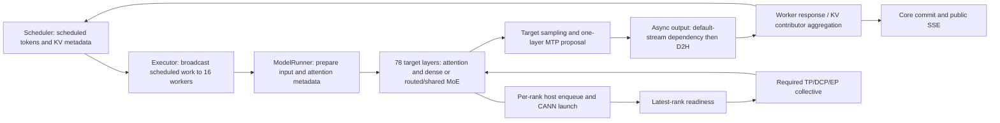

# Run249 Decode critical path: existing evidence, source, candidate

Latest: [checkpoint164](CHECKPOINT164.md) adds per-round critical-rank changes, current-scope gap ownership, the minimal profiling-OFF CPU-clock limit and a second concrete event patch with repeated complete23-token evidence. [H5 decision](H5_DECISION.md) separates D generation gain from P drift. Current P249/D253 is healthy/idle with stock semantics; the Run251 service descriptions below are historical. No formal PERF_KEEP or product Current promotion.

This is a new attribution of immutable Run249, not a rewrite of its result. No new NPU profile or parameter sweep was used. Profiling-off 265.290943ms/token and profiling-on 336.029329ms/token are separate regimes. The profiled device window cannot numerically decompose the unprofiled number.

## Actual step and dependency chain

Eight emitted token IDs `[785,1196,374,10156,264,3405,304,8452]` arrived in chunks 1/2/2/2/1. The D trace contains **five target plus MTP rounds**, each with 78 target attention layers/75 target MoE layers and one draft attention/MoE layer. Eight tokens are not eight device steps.

Source authority is the installed source archives (`installed_sources.json`, `model_sources.json`, `collective_api_sources.json`), with original-file SHA256. Text collected with `read_text()` normalizes CRLF; hashes identify original bytes. Target registration selects AscendGlmMoeDsaForCausalLM/deepseek_mtp and the DeepSeekV2 backbone. ModelRunner sample_tokens submits target sampling, draft and connector finalization before constructing AsyncGPUModelRunnerOutput. Its copy stream waits on the default stream; WorkerAsyncOutputCopy resolves the event before the worker response. MultiprocExecutor's KV aggregator can require every worker reply. These dependencies remain intact.

## Quantified attribution

All D ranks are on host167 in the same profiler clock domain. Match exact collective group/operation/ordinal, not similarly named events across hosts.

| Existing evidence | Observation | Interpretation |
|---|---:|---|
| 1901 common HCCL operations across D16 | Sum of start skews 2008.906ms; last-start to final-end sum 32.572ms | Peer readiness dominates these measured extents. Sums overlap and are not removable wall time. |
| CANN connection joins | Latest host-launch rank equals latest device-start rank in 1896/1901 operations | Late entry is predominantly late host submission, rather than transfer taking a long time after all peers are ready. |
| Latest-rank launch-end to device-start | Median24.825us; 1898/1901 below200us | Slow rank has little queued work immediately before these collectives. Small negative values preclude exact sub-100us ordering claims. |
| D15 target-first-device to last sampled D2H, 2840.531ms | Non-event task activity1066.175ms; no such activity1774.356ms | Slow-rank supply is the largest localized framework issue in this profiled window. Absence of tasks is not by itself removable overhead. |
| D15 main stream adjacent-task gaps | 902.280ms lies before the next task's host launch begins | Direct late-feed evidence; not a whole-product saving estimate. D0's corresponding bound is only5.485ms, because faster peers wait inside communication/event tasks. |
| D15 third round, device embedding to sampled D2H | Extent603.685ms; non-event active47.175ms; inactive556.510ms | A representative late-feed round. Later D15 rounds have similarly about47ms task activity and530ms uncovered time. Earlier slow-rank ownership differs. |
| D0 CPU output-event sync | About2.55/29.36/85.35/118.34/132.13ms | Device/peer backlog and output-copy dependency; not automatically serialized Scheduler or removable host cost. |

Model attention/projections, W8A8 dense/expert kernels, routing, shared expert, required KV reads and MTP compute remain necessary. Task-type IDs are rank-specific STRING_IDS entries; unnamed MIX_AIC/MIX_AIV tasks must not be misclassified as framework control. Group suffixes alone do not determine logical TP versus DCP versus EP ownership. The installed SFA resolver selects **AscendSFADCPImpl**, with DSA-CP disabled and DCP16 enabled. The legacy `dsa_cp.py` TP head-layout path is inactive here; its TP-group all-to-all must not be substituted for the actual SFA/DCP path.

### Necessary communication in this actual model path

| Role / observed operation | Count in five rounds | Producer and consumer |
|---|---:|---|
| TP group3 all-reduce |800|Sharded embedding/projection and shared/dense FFN results before subsequent residual/norm/layer consumption. Count is observed; exact per-call functional assignment is not inferred merely from a named scope.|
| TP group3 MoE all-gather |380|MC2 finalized token shards reconstructed before the next layer; necessary collective, avoidable list-output materialization.|
| TP group3 LM-head all-gather |10|Five target and five draft vocabulary-logit gathers before sampling.|
| DCP group5 all-gather |395|First round:79 compact KV gathers, local count221184. Four later rounds:316 packed Q gathers, local count4608.|
| DCP group5 all-to-all |316|Four later rounds ×79 partial attention output/LSE merges, `vllm::sfa_dcp_a2a_fused`.|
| EP MC2 dispatch / combine |380 each|Expert token exchange and weighted output return inside `MoeDistributeDispatchV2` / `MoeDistributeCombineV2`; additional to the1901 standard HCOM records.|
| MTP |Included above|One draft attention and MoE layer per round, plus its embedding/logit/sample dependency.|

Installed `sfa_v1.py:129` resolves through `sfa_cp.py:1303`; `sfa_cp.py:930` starts compact KV gather after cache writes, `:983` and `distributed/utils.py:17` issue `all_gather_into_tensor` on **dcp_group.device_group**. First-step `_has_prefill` metadata selects the complete-KV attention path and skips query gather/remap/LSE merge. Later Decode uses packed Q gather (`:1094`), sparse index remap and local SFA, then `sfa_dcp_a2a_fused(..., self.dcp_group.unique_name)` (`:1080`). Its output is required by O projection. First-step prefill metadata does not imply full-prompt local fallback: client and native metrics show all2334 external KV hits, with failure policy `fail`. Actual layer traversal is the installed `_patched_forward` in `patch/worker/patch_deepseek_v2.py:293–357`.

### Device round versus peer waiting

`step_timeline.json` and its offline reducer use actual device embedding tasks and sampled-output D2H copies. A representative third round illustrates why summing r0 communication and event waits gives a false explanation:

| Rank / third round | Extent | Named math union | HCOM union | EP dispatch/combine union | Event-wait union | Non-event task union |
|---|---:|---:|---:|---:|---:|---:|
|D0|609.603ms|70.151ms|413.963ms|156.179ms|609.603ms|608.569ms|
|D13|609.611ms|68.287ms|438.819ms|133.126ms|609.611ms|608.586ms|
|D15|603.685ms|36.355ms|3.832ms|4.144ms|3.470ms|47.175ms|

Columns overlap across streams; **do not add them**. Named math excludes unnamed subtasks and is not a theoretical compute floor. Early ranks wait inside HCOM/EP kernels and stream events while D15 supplies work late. The copy-stream wait can span the main-stream dependency chain. Deleting it or calling it a600ms redundant barrier is incorrect. No explicit HCOM barrier appears among the matched1901 operations; host barriers outside the captured chain are not thereby proved absent.

D15's five round extents are486.538/571.159/603.685/577.074/577.171ms; its last three non-event task unions47.175/47.052/46.946ms. Sampled D2H end to next device embedding is4.392/7.105/6.706/6.700ms. These boundary intervals cannot be assigned directly to Scheduler CPU overhead: input prep can overlap prior work. They provide no justification for assigning the hundreds of milliseconds of within-layer late supply to inter-step scheduling. Scheduler/Core/Executor/ModelRunner entry/exit times are not individually present; exact four-way wall numbers remain unknown.

Communication, compute, event/barrier and copy intervals overlap. The critical dependency is the latest producing rank, followed by the collective and its caller-stream join. For example `hcom_allReduce__503_476_1`: r0 queued about23.9ms before its entry; r15's CANN launch ends1791285355679120210ns, device entry1791285355679152238ns. Its prior masked-fill finishes1791285355679006201ns, followed by record-event/communication-stream wait, collective, then caller-stream wait and RMSNorm. Deleting the wait would consume incomplete input.

Scheduler/Core/Executor do not have explicit step markers in this acquisition. Their exact individual wall-time gaps remain unknown. The trace does establish that repeated **within-model** late submissions occur hundreds of times inside the target-layer chain; output aggregation alone cannot explain that chain. Do not label CPU embedding boundaries as device step boundaries, or add CPU inclusive scope durations.

### Producer versus runtime queue

Offline Job GLM53-DECODE-QUEUES-20261006 reads existing D13/D15 PYTORCH_API queue records on **all** host threads:44511 Enqueue/44511 Dequeue pairs for D15. CONNECTION_IDS links the matching queue-flow IDs; CANN launch lies within the matched Dequeue interval on the background task-queue thread. `join_queues.py` partitions exposed main-stream gaps ending at the next host launch, without adding overlapping Enqueue/Dequeue calls. Queue push itself is not exported, so Enqueue start is an earliest-ready bound.

| Rank | Host-launch-late interval | Before producer Enqueue begins | Enqueue-start to Dequeue | Dequeue to CANN launch |
|---|---:|---:|---:|---:|
| D13 |510.710ms|416.999ms|62.754ms|30.956ms|
| D15 |902.406ms|747.341ms|94.418ms|60.647ms|

This local partition includes all adjacent stream47 tasks and is slightly wider than the earlier filtered902.280ms bound. The largest part is **the producer has not enqueued the next task**, rather than a large queue backlog. It includes necessary host work, profiler cost, generic operator preparation and CPU scheduling; it is not747ms of proven removable Python. Next-operation labels do not identify which preceding source caused a gap.

D15's next-enqueue classes with the greatest accumulated exposed delay are MC2 dispatch128.464ms, combine111.928ms, wait_event104.877ms, record_event76.916ms, sparse-index remap58.557ms, dynamic quant51.058ms. Exact raw edge examples and task/queue rows are in `queue_critical_edges.json`. The790.528us dispatch gap contains a normal `npu::npu_moe_distribute_dispatch_v2` host scope of about749us, output allocations, then the8us ACL enqueue scope. Its long host frontend preparation is distinct from the eventual device communication. The largest1164.825us edge occurs within MLA before sparse-index remap and includes allocation/view preparation. Source confirms these are **inside the target-layer path**, rather than Scheduler admission gaps.

MoE dispatch/combine inclusive host scopes total203.617/187.673ms; event record/wait87.862/48.728ms; list gather209.726ms. These are overlapping inclusive observations, not additive costs. H4 was the sole active candidate during Run251; it was parked and restored before H5, so no performance interventions were stacked.

## Concrete removable code

`PrepareAndFinalizeWithAll2All.finalize` allocates a private full-output tensor, splits it into16 views, and calls list-output `dist.all_gather`. MC2's normal finalize inherits this path. There are380 such MoE calls (76 ×5), and **6080 output-copy tasks** (16 ×380). D15 `c10d::allgather_` inclusive host time totals209.726ms, median546.905us. This total includes the necessary collective and is not a saving prediction.

Contained-scope attribution sharpens this beyond the209ms total: exactly6080 `aten::copy_` scopes within those380 list gathers occupy112.574ms of D15 host wall time. The380 final output `tensor_split` calls immediately before those gathers occupy14.629ms. Their disjoint union is127.203ms in the ON-profile, and both code paths are removed by the patch. Prepare has three other splits per MoE; all1520 splits'60.594ms must not be assigned to this patch. `gather_materialization.json` records counts, containment and union; nested select/reshape/ACL/Enqueue rows overlap and are not added. This identifies avoidable implementation work, while exposure and profiler-OFF gain are established separately by the comparison.

Exact torch_npu2.10.0.post4 source commit `5dd8ef3f9b375b5ae4a83538d5785754148c3302`, ProcessGroupHCCL.cpp `allgather` (around5572) flattens output, invokes HcclAllGather, then copies each slice into the list. `_allgather_base` (around5895) invokes the same HcclAllGather directly into the private destination and records its stream lifetime. Both normalize input format. The list path also pads to512B on910C; the candidate fast path is restricted to equal positive shards with local byte size divisible by512. GLM hidden6144 satisfies this. Other shapes retain the old method.

Candidate `moe_gather.patch` removes split/list materialization and per-slice output copies, retaining collective order, group, rank order, dtype, necessary communication, padding/unpadding, fresh output and all downstream dependencies. No model/kernel computation changes. Global padded shape determines the collective branch; input `.contiguous()` cannot cause ranks to choose different APIs. Failed collectives are never retried through another API.

Four-rank real CPU/Gloo correctness passed60 cases/rank for dynamic rows, FP32/FP16/BF16, contiguous/noncontiguous inputs, expected independent values, input preservation and retained output lifetime. The first Job predates the512B guard; **GLM53-GATHER-CPU-20261006-B** retested the final guarded candidate and exact original CRLF source, CLI/inner exits0. Gloo alone does not establish HCCL correctness. Independent review: ASTRA_MOE_GATHER_DIFF_REVIEW.md.

## Native correctness → matched A/B → complete E2E

[Run250](../../runs/GLM-RUN-0250/summary.md) is preserved as a failed diagnostic: B2 rank12 hit an ambiguous combined `torch.equal` predicate and stranded peers. That gate was not bitwise and checked only the unpadded real row. Its failing operands were not saved; the actual rank12 cause remains unknown. Complete answer74A versus8B is MIXED and cannot be used as a code gain.

[Run251](../../runs/GLM-RUN-0251/summary.md) recovered only owned D, then passed **16 rank ×20 native HCCL cases** with full padded byte layout, independent rank-coded expected data, input preservation, unpad, output lifetime, noncontiguous inputs and NaN/Inf/signed-zero payload. It then loaded D once for recovery and compared A1/B1/A2/B2 in the same16 resident workers. P, geometry, model, sampling/MTP and profiler-OFF regime stayed fixed. The executed candidate function AST equals the patch function. Warm correctness was excluded from timed samples and reduced all-rank status before throwing.

Both B warm gates passed full-output/input bytes on all16 ranks. Real padding contained NaNs: B1 rank7 had22, B2 ranks14/15 had24 each. Byte equality still passed. This demonstrates the old gate's unsuitability for actual padding, without retrospectively proving the old rank12 operands.

| Matched pair | Short TPOT medians | Reduction | Complete PD wall, same3 tokens and natural EOS |
|---|---:|---:|---:|
|A1 → B1|263.843 →246.900ms/token|6.42%|1.693434 →1.660282s (1.96%)|
|A2 → B2|260.413 →233.540ms/token|10.32%|1.745766 →1.566286s (10.28%)|

Each short mode has two samples with identical8 token IDs/chunks1/2/2/2/1 and2334 external KV hits. These are diagnostic TPOT, not SLA percentiles or per-token ITL. Complete requests use the same dynamic API body with `thinking_token_budget=0`; all return `2`, token IDs `[154842,17,154827]`, chunks1/1/1, finish=`stop`,38 external KV hits. The first complete pair's1.96% difference is near observed phase drift, so formal repeatable complete Product Gain remains **INCONCLUSIVE**. No PERF_KEEP or Current promotion.

Complete D-client wall decreases1.306208→1.264291s (3.21%) and1.335283→1.186958s (11.11%). In pair2, unchanged P nonetheless runs31.16ms faster; that contributes to the179.48ms total PD difference and cannot be credited to the D patch. Four complete requests are too narrow for a stable service/capacity claim. `reduce_compare.py` independently recomputes short TPOT, tokens and chunks from original arrived-ns event records; complete overall wall remains the actual client-recorded timing.

The comparison confirms a specific avoidable framework component while leaving most latency unresolved: eager producer work, generic operator/output allocation/preparation, event submission and host CPU scheduling remain attribution questions, not new enabled interventions. The profile identifies the largest localized region, **within-model late host supply**, but neither the747ms ON-profile producer interval nor the209ms gather inclusive scope is a globally removable OFF-profile budget.

Both health200, idle and16 NPU owners per role were independently checked after completion. P remains Run249; D is fresh Run251. D mode0 and original on-disk source SHA54e8ac… restored. Resident D retains the diagnostic selector in memory at stock mode; it was not reloaded again merely to erase instrumentation. No new profile, large workload or parameter scan was run.

## Evidence and remaining decision

Original Run249 D0 trace194035643bytes SHA396d4224469486c094891b35a7e2b0c7e94b1fca500f050e90f548ff19e7e8d0; all16 original traces and SQLite hashes are recorded by offline Job GLM53-DECODE-TRACE-20261006 and B. JobA's computation completed but bridge rejected its string `finding.scope`; preserved as protocol INVALID, not silently repaired. JobB actual CLI/inner exits0 and valid bridge. Large traces/gzip selections stay on servers. Compact cross_rank_collective_start.json and launch_analysis.json are new reductions of existing data.

Leading issue: eager per-layer host supply on the slowest ranks. List-gather materialization is the strongest specific removable path identified so far, with native correctness and matched profiler-OFF short-request evidence. It is not a proof of globally maximal savings or repeatable complete Product Gain. Profiler overhead, CPU scheduling and remaining allocations/metadata dispatch can explain additional host delay. Source SHA authority: `source_identity_map.json`; original Run artifact identities: `evidence_index.json`. Current=None; no new PERF_KEEP.
