# Decode causal path and what the timestamps establish

The largest localized delay is repeated within-layer late host supply on the critical rank. The slow rank switches from principally D13 in the first two profiled rounds to D15 in the last three. It is not explained by assigning early-rank communication/event durations to network transfer. This closes the concrete native predicate mechanism; it does not fabricate an exclusive decomposition of profiling-OFF265.290943ms/token from profiling-ON336.029329ms/token.

A real target+MTP round traverses78 target attention layers/75 target MoE layers plus one draft attention/MoE. Five such rounds emit eight tokens; emitted-token count is not execution-step count. The actual SFA/DCP implementation and SP-disabled applicability are verified in [CRITICAL_PATH](CRITICAL_PATH.md) and [graph correction](GRAPH_APPLICABILITY_CORRECTION.md).

```mermaid
flowchart LR
  S[Scheduler scheduled work / KV metadata] --> E[MultiprocExecutor worker broadcast]
  E --> R[ModelRunner inputs and attention metadata]
  R --> P[Late rank per-layer producer]
  P --> A[MC2 allocations then repeated availability query]
  A --> X[Dynamic descriptor / workspace / queue submission]
  X --> Q[Queue consumer CANN launch]
  Q --> C[TP / DCP / EP collective after peer readiness]
  C --> J[Required stream join / model consumer]
  J --> P
  J --> M[Sampling / MTP / connector finalization]
  M --> D[Default-stream dependency then output D2H]
  D --> W[Worker event sync / response / KV contributor aggregation]
  W --> O[Core commit / SSE and next scheduling]
```

These are source-required dependencies with observed boundaries; event handles and exact Scheduler/Executor/ModelRunner entry/exit are not exported. It is not a fully reconstructed timestamped event DAG. Output-copy waits and collective joins cannot be removed from this dependency graph.

## Required model/communication versus wait

Across five profiled rounds, actual TP800 all-reduces,380 MoE all-gathers and10 target/draft logit gathers are necessary; list-output materialization around the380 gathers is the separately tested H4 cost. DCP395 gathers include first-round79 compact-KV gathers and316 later packed-Q gathers, followed by316 output/LSE all-to-alls. EP380 dispatch+380 combine are extra to1901 standard HCOM records. MTP's one draft layer and logit/sample operations are included, not a separate arithmetic-free control path. Named and unnamed MIX_AIC/MIX_AIV model tasks must retain their real computation.

Exact1901 group/op HCOM matches show latest host-END rank==latest device-start rank1896/1901, and latest host-START1897/1901. One checked second-round gather changes rank13/14 between these definitions; preserve both. EP ordinal/source/device-round checks show latest host START and END rank==device rank760/760, all last-three-round EP entries D15. Latest host-end→device median across EP rounds39.482/50.121/63.635/76.031/78.358us. There is little post-ready device-start delay on these latest peers; early peers wait for supply. Summed skew and last-entry→final-end extents overlap and are not removable wall budgets.

For third round, D15 embedding→sampled D2H603.685ms, named math union36.355ms, HCOM3.832ms, EP4.144ms, event-wait3.470ms, non-event task union47.175ms. D0/13 event-wait unions roughly609ms and HCOM/EP hundreds of ms include waiting for D15. These columns overlap across streams and cannot be added or treated as a hardware/model floor. No named HCOM barrier appears; an uncaptured host barrier is not proved absent.

## Host producer, queue and propagation

Existing CANN connection/queue flow joins give disjoint local launch-late partitions: D15 before-enqueue747.341ms, enqueue-start→dequeue94.418ms, dequeue→CANN60.647ms; D13416.999/62.754/30.956ms. Enqueue-start is an earliest-ready bound because actual push is absent. Queue pending can contain necessary earlier work. CPU contemporaneous-scope ownership gives D15 pre-enqueue MoE531.027/MLA173.377/outside42.937ms, not an attribution from next-op labels.

[Same-call MC2 closure](mc2_frontiers_summary.json) joins380 native envelopes/op/rank to matching EP task ordinals, one exact queue flow and main-thread workspace calls, with all nesting/round/unique enqueue checks. D15391.290ms native wall partitions343.929ms unexported pre-enqueue,10.786ms allocation-exclusive,18.188ms workspace-exclusive,1.732ms other CANN,2.289ms allocator event queries,4.636ms enqueue and9.730ms post-enqueue unexported. Inclusive workspace19.921ms overlaps these categories and is not added. Native local pre-enqueue exposure239.431ms includes221.353ms unexported. The raw is ON and includes profiling/scheduling; that221ms is not a patch budget.

D15 native entry→enqueue376.925ms has375.434ms without an overlapping exported consumer callback. This does **not** prove a runnable idle consumer; polling, uncaptured work and scheduling remain unknown. Same round/ordinal comparison shows D15 native entry already later than D13 by median34.0/63.4/57.5ms in last three rounds, while individual native pre-enqueue duration deltas are only41/30/30us. Late supply accumulates through preceding model/host work and propagates through peer joins; it is not solely the current call's duration.

[Run258 same-call task-clock boundaries](NATIVE_BOUNDARY_DECISION.md) resolves the main MC2 pre-workspace unknown: repeated capability queries take77.64%/77.05% of D15/D13 measured native preparation CPU. Dynamic descriptor/cache/determinism interval and workspace wrapper each have roughly22–25us medians; the predicate323–346us. CPU and wall nearly coincide with signed uncertainty retained. This is a large concrete framework lookup cost rather than required model math/EP exchange. It cannot be scaled into an exclusive whole-step fraction.

## Inter-layer source and whole-envelope CPU

The [Run258 measured main-thread envelope](INTERLAYER_SOURCE_DECISION.md) is not77% native: D15 first-dispatch→last-combine CPU2120.453ms partitions native331.196/routedMLP153.028/inter-layer1636.228ms, with prefix/final suffix excluded. Run249 alone disjoins the inter-layer region into379 post-combine MoE tails(finalize **and** shared expert),391 MLA scopes, next prepare/route/gate and norm/control. Profile-ON local exposure204.649/171.858/72.462/42.575ms is not scaled into CPU or OFF savings.

380 post-combine sequences separate required shared W8A8 computation from list-gather materialization and event waits. The [source decision](INTERLAYER_SOURCE_DECISION.md) preserves H4/H5 nested subsets and the379/380 window difference; those mechanisms already have separate interventions. [Producer-side collective mapping](collective_producers.json) accounts800 TP sums exactly as attention395/shared380/dense15/embedding10; separate shared TP sum is necessary after routed token-gather, not duplicate final reduction. CPU actual-registration TLS36cases preserves inference/keys; no blanket autograd guard or boxed bypass follows from sampled names. No larger, specific, proven deletion than H6 emerges from the mixed total.

## Control/output interval limits and code disposition

D15 sampled D2H→next device embedding4.392/7.105/6.706/6.700ms includes worker response, aggregate/Core scheduling and input preparation; ModelRunner work may overlap. The raw lacks exact four-layer entry/exit markers, so Scheduler / Executor / ModelRunner / Core exclusive durations remain unknown. Hundreds of within-layer late submissions cannot be reassigned to this short inter-round boundary. Required copy-stream/default-stream dependency and all-rank connector aggregation remain.

The maximum currently **identified and intervention-validated specific native preparation cost** is the MC2 predicate. The two-site H6 cache passed native/correctness and repeated common-worker A/B/A/B plus complete natural-EOS PD; TPOT−13.62/−14.20%, complete PD wall−11.51/−14.41%, with P drift separate. H4 list-copy and H5 single-stream event interventions are smaller, separately tested and not stacked. Local prepare and outer boxed-entry directions are parked/stopped as main explanations. Formal KEEP/full API/SLA capacity and globally maximum removable OFF wall remain unaccepted/unknown. The remaining research is source-level eager host work and release qualification, not another predicate/V2 observation or a parameter scan.
